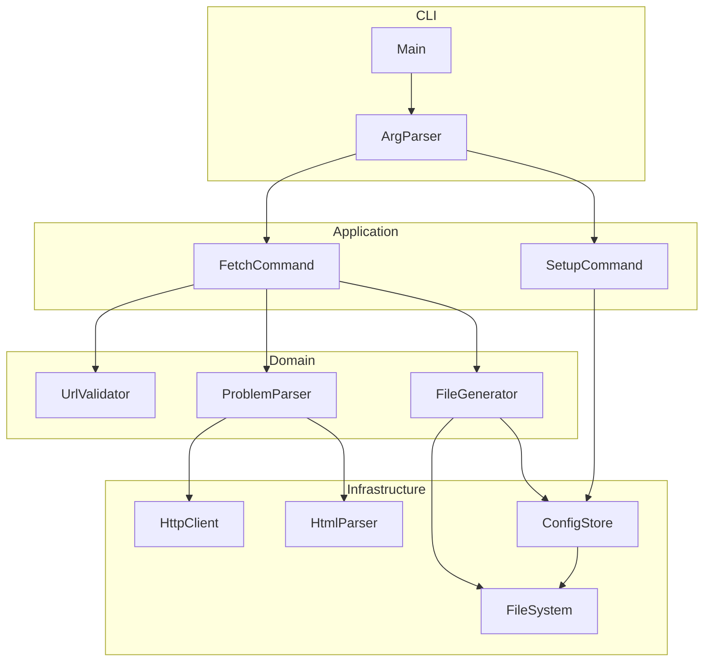
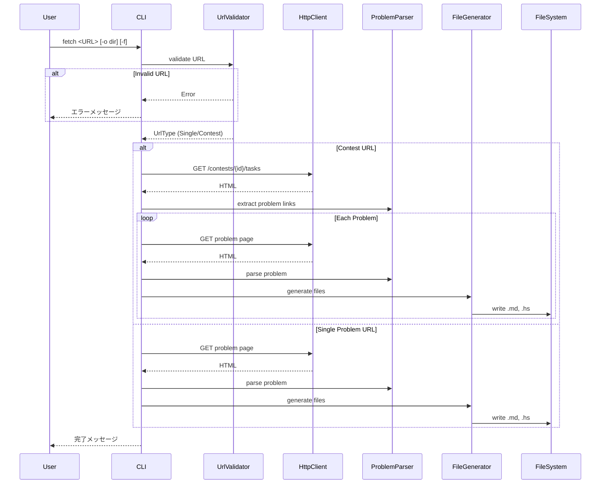
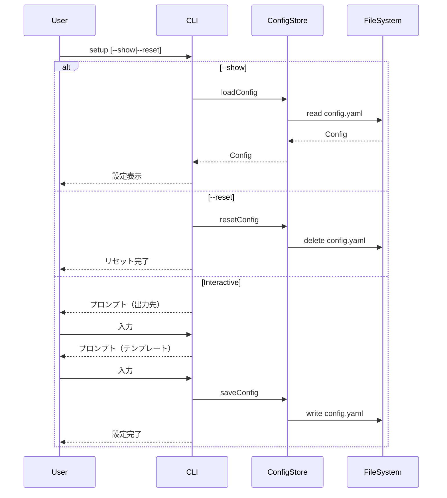
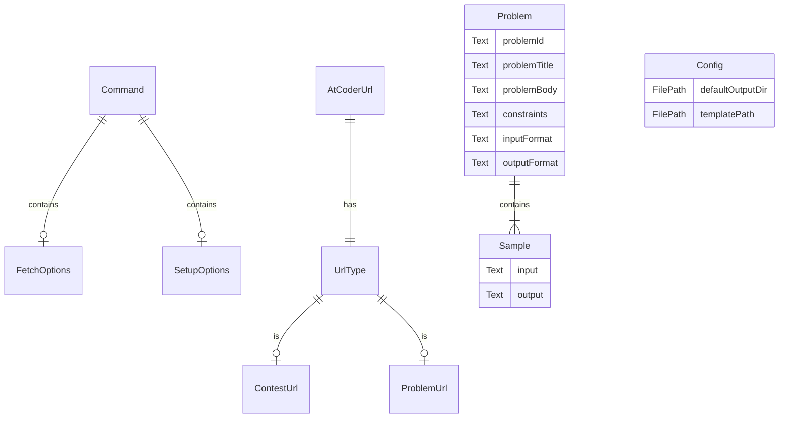

# Technical Design: atcoder-problem-fetcher

## Overview

**Purpose**: AtCoder の問題 URL から問題文と Haskell ソースファイルを自動生成し、競技プログラマーの環境準備を効率化する CLI ツール。

**Users**: AtCoder に参加する Haskell 競技プログラマーが、コンテスト開始時や過去問練習時に使用する。

**Impact**: 手動での問題文コピーとファイル作成を自動化し、コーディング開始までの時間を短縮する。

### Goals
- AtCoder の問題ページから問題文を自動取得しマークダウン形式で保存
- テンプレート付きの空の Haskell ファイルを自動生成
- コンテスト一括取得と単一問題取得の両方をサポート
- 設定ファイルによるデフォルト値の永続化

### Non-Goals
- AtCoder へのログイン認証（公開問題のみ対象）
- 解答の自動提出機能
- サンプルケースの自動テスト実行
- AtCoder 以外のオンラインジャッジ対応

## Architecture

### Architecture Pattern & Boundary Map



**Architecture Integration**:
- **Selected pattern**: シンプルモジュール分離（CLI ツールに適したレイヤー構成）
- **Domain/feature boundaries**: CLI → Application → Domain → Infrastructure の一方向依存
- **Existing patterns preserved**: Haskell 標準のモジュール分離、steering の命名規則に準拠
- **New components rationale**: 各コンポーネントは単一責務を持ち、テスト容易性を確保
- **Steering compliance**: 明示的な型注釈、total function の使用を維持

### Technology Stack

| Layer | Choice / Version | Role in Feature | Notes |
|-------|------------------|-----------------|-------|
| CLI | optparse-applicative 0.18+ | コマンドライン引数パース | サブコマンド、自動ヘルプ |
| HTTP | http-conduit 2.3+ | AtCoder ページ取得 | Network.HTTP.Simple API |
| HTML Parser | tagsoup 0.14+ | HTML パース・抽出 | 不正 HTML 対応 |
| Config | yaml 0.11+ | 設定ファイル読み書き | aeson 統合 |
| Text | text, bytestring | テキスト処理 | UTF-8 エンコーディング |

## System Flows

### Fetch コマンドフロー



### Setup コマンドフロー



## Requirements Traceability

| Requirement | Summary | Components | Interfaces | Flows |
|-------------|---------|------------|------------|-------|
| 1.1, 1.2 | fetch/setup サブコマンド | ArgParser | Command | - |
| 1.3, 1.4 | 不正入力エラー | ArgParser | - | - |
| 2.1-2.6 | 設定管理 | SetupCommand, ConfigStore | Config | Setup Flow |
| 3.1-3.5 | URL 検証 | UrlValidator | UrlType, AtCoderUrl | - |
| 4.1-4.8 | コンテスト一括取得 | FetchCommand, ProblemParser | Problem, FetchResult | Fetch Flow |
| 5.1-5.4 | 単一問題取得 | FetchCommand, ProblemParser | Problem | Fetch Flow |
| 6.1-6.4 | HTML 取得・パース | HttpClient, HtmlParser, ProblemParser | Problem | Fetch Flow |
| 7.1-7.5 | 出力ディレクトリ | FileGenerator, ConfigStore | OutputPath | - |
| 8.1-8.4 | Markdown 生成 | FileGenerator | ProblemMarkdown | - |
| 9.1-9.6 | Haskell ファイル生成 | FileGenerator | HaskellTemplate | - |
| 10.1-10.4 | 結果表示 | FetchCommand | FetchResult | - |

## Components and Interfaces

| Component | Domain/Layer | Intent | Req Coverage | Key Dependencies | Contracts |
|-----------|--------------|--------|--------------|------------------|-----------|
| ArgParser | CLI | コマンドライン引数パース | 1.1-1.4, 3.5 | optparse-applicative (P0) | Service |
| FetchCommand | Application | fetch サブコマンド実行 | 3.1-3.4, 4.1-4.8, 5.1-5.4, 10.1-10.4 | ProblemParser (P0), FileGenerator (P0) | Service |
| SetupCommand | Application | setup サブコマンド実行 | 2.1-2.6 | ConfigStore (P0) | Service |
| UrlValidator | Domain | URL 検証・分類 | 3.2-3.4 | - | Service |
| ProblemParser | Domain | 問題ページ解析 | 6.1-6.4 | HttpClient (P0), HtmlParser (P0) | Service |
| FileGenerator | Domain | ファイル生成 | 7.1-7.5, 8.1-8.4, 9.1-9.6 | FileSystem (P0), ConfigStore (P1) | Service |
| HttpClient | Infrastructure | HTTP リクエスト | 6.1, 6.3 | http-conduit (P0) | Service |
| HtmlParser | Infrastructure | HTML パース | 6.2, 6.4 | tagsoup (P0) | Service |
| ConfigStore | Infrastructure | 設定永続化 | 2.4-2.6, 7.2 | yaml (P0), FileSystem (P0) | Service |
| FileSystem | Infrastructure | ファイル I/O | 7.4-7.5, 8.4, 9.6 | base (P0) | Service |

### CLI Layer

#### ArgParser

| Field | Detail |
|-------|--------|
| Intent | コマンドライン引数をパースし Command 型に変換 |
| Requirements | 1.1, 1.2, 1.3, 1.4, 3.5 |

**Responsibilities & Constraints**
- optparse-applicative を使用してサブコマンドをパース
- fetch, setup の2つのサブコマンドを定義
- 不正な入力に対するエラーメッセージとヘルプを自動生成

**Dependencies**
- External: optparse-applicative — CLI パーサー (P0)

**Contracts**: Service [x]

##### Service Interface
```haskell
data Command
  = Fetch FetchOptions
  | Setup SetupOptions

data FetchOptions = FetchOptions
  { fetchUrl    :: Text
  , outputDir   :: Maybe FilePath
  , forceWrite  :: Bool
  }

data SetupOptions
  = SetupInteractive
  | SetupShow
  | SetupReset

parseCommand :: IO Command
-- Preconditions: なし
-- Postconditions: 有効な Command を返す、または使用方法を表示して終了
```

### Application Layer

#### FetchCommand

| Field | Detail |
|-------|--------|
| Intent | fetch サブコマンドのビジネスロジックを実行 |
| Requirements | 3.1, 3.2, 3.3, 3.4, 4.1-4.8, 5.1-5.4, 10.1-10.4 |

**Responsibilities & Constraints**
- URL の種類に応じて単一/一括取得を切り替え
- 進捗表示とエラーハンドリング
- 部分的失敗時も成功分は保持

**Dependencies**
- Inbound: ArgParser — Command 受け取り (P0)
- Outbound: UrlValidator — URL 検証 (P0)
- Outbound: ProblemParser — 問題取得・解析 (P0)
- Outbound: FileGenerator — ファイル生成 (P0)

**Contracts**: Service [x]

##### Service Interface
```haskell
data FetchResult = FetchResult
  { successCount :: Int
  , failedCount  :: Int
  , generatedFiles :: [FilePath]
  , errors :: [FetchError]
  }

data FetchError
  = NetworkError Text
  | ParseError Text
  | FileError Text

runFetch :: FetchOptions -> IO FetchResult
-- Preconditions: FetchOptions が有効
-- Postconditions: 取得結果を返す、エラーは FetchResult.errors に格納
```

#### SetupCommand

| Field | Detail |
|-------|--------|
| Intent | setup サブコマンドのビジネスロジックを実行 |
| Requirements | 2.1, 2.2, 2.3, 2.4, 2.5, 2.6 |

**Responsibilities & Constraints**
- 対話的設定、設定表示、設定リセットの3モード
- 設定ファイルの読み書きを ConfigStore に委譲

**Dependencies**
- Inbound: ArgParser — Command 受け取り (P0)
- Outbound: ConfigStore — 設定永続化 (P0)

**Contracts**: Service [x]

##### Service Interface
```haskell
runSetup :: SetupOptions -> IO ()
-- Preconditions: なし
-- Postconditions: 設定が更新/表示/リセットされる
```

### Domain Layer

#### UrlValidator

| Field | Detail |
|-------|--------|
| Intent | AtCoder URL を検証し種類を判定 |
| Requirements | 3.2, 3.3, 3.4 |

**Responsibilities & Constraints**
- URL 形式の正規表現マッチング
- コンテスト一覧 URL と個別問題 URL の判定
- AtCoder 以外の URL を拒否

**Dependencies**
- External: text — 正規表現 (P1)

**Contracts**: Service [x]

##### Service Interface
```haskell
data UrlType
  = ContestUrl ContestId
  | ProblemUrl ContestId ProblemId

type ContestId = Text
type ProblemId = Text

data AtCoderUrl = AtCoderUrl
  { urlType   :: UrlType
  , rawUrl    :: Text
  }

validateUrl :: Text -> Either Text AtCoderUrl
-- Preconditions: なし
-- Postconditions: 有効な AtCoderUrl または エラーメッセージ
-- Invariants: AtCoderUrl は常に atcoder.jp ドメイン
```

#### ProblemParser

| Field | Detail |
|-------|--------|
| Intent | AtCoder ページを取得し問題データを抽出 |
| Requirements | 6.1, 6.2, 6.3, 6.4, 4.3 |

**Responsibilities & Constraints**
- HTML 取得を HttpClient に委譲
- HTML パースを HtmlParser に委譲
- 問題構造（タイトル、本文、制約、サンプル）を抽出

**Dependencies**
- Outbound: HttpClient — HTTP リクエスト (P0)
- Outbound: HtmlParser — HTML パース (P0)

**Contracts**: Service [x]

##### Service Interface
```haskell
data Problem = Problem
  { problemId    :: ProblemId
  , problemTitle :: Text
  , problemBody  :: Text
  , constraints  :: Text
  , inputFormat  :: Text
  , outputFormat :: Text
  , samples      :: [Sample]
  }

data Sample = Sample
  { sampleInput  :: Text
  , sampleOutput :: Text
  }

fetchProblem :: AtCoderUrl -> IO (Either FetchError Problem)
-- Preconditions: UrlType が ProblemUrl
-- Postconditions: Problem または エラー

fetchContestProblems :: AtCoderUrl -> IO (Either FetchError [AtCoderUrl])
-- Preconditions: UrlType が ContestUrl
-- Postconditions: 問題 URL リスト または エラー
```

#### FileGenerator

| Field | Detail |
|-------|--------|
| Intent | 問題データからファイルを生成 |
| Requirements | 7.1-7.5, 8.1-8.4, 9.1-9.6 |

**Responsibilities & Constraints**
- Markdown 形式で問題文を出力
- テンプレートから Haskell ファイルを生成
- 既存ファイルの上書き確認

**Dependencies**
- Outbound: FileSystem — ファイル I/O (P0)
- Outbound: ConfigStore — テンプレートパス取得 (P1)

**Contracts**: Service [x]

##### Service Interface
```haskell
data GenerateOptions = GenerateOptions
  { outputDir   :: FilePath
  , forceWrite  :: Bool
  , contestDir  :: Maybe Text  -- コンテスト一括時のディレクトリ名
  }

data GenerateResult = GenerateResult
  { markdownPath :: FilePath
  , haskellPath  :: FilePath
  }

generateFiles :: Problem -> GenerateOptions -> IO (Either FetchError GenerateResult)
-- Preconditions: Problem が有効、outputDir が書き込み可能
-- Postconditions: ファイルが生成される、または上書き確認で中止
```

### Infrastructure Layer

#### HttpClient

| Field | Detail |
|-------|--------|
| Intent | HTTP GET リクエストを実行 |
| Requirements | 6.1, 6.3 |

**Responsibilities & Constraints**
- http-conduit を使用
- User-Agent ヘッダー設定
- タイムアウト処理

**Dependencies**
- External: http-conduit — HTTP ライブラリ (P0)

**Contracts**: Service [x]

##### Service Interface
```haskell
fetchHtml :: Text -> IO (Either FetchError ByteString)
-- Preconditions: URL が有効
-- Postconditions: HTML ByteString または ネットワークエラー
```

#### HtmlParser

| Field | Detail |
|-------|--------|
| Intent | HTML をパースしてデータ抽出 |
| Requirements | 6.2, 6.4 |

**Responsibilities & Constraints**
- TagSoup で HTML をタグリストに変換
- セクションベースでコンテンツ抽出

**Dependencies**
- External: tagsoup — HTML パーサー (P0)

**Contracts**: Service [x]

##### Service Interface
```haskell
data ParsedPage = ParsedPage
  { pageTitle   :: Text
  , sections    :: [(Text, Text)]  -- (見出し, 内容)
  , problemLinks :: [Text]  -- 問題一覧ページ用
  }

parseHtml :: ByteString -> Either FetchError ParsedPage
-- Preconditions: HTML が UTF-8
-- Postconditions: ParsedPage または パースエラー
```

#### ConfigStore

| Field | Detail |
|-------|--------|
| Intent | 設定ファイルの読み書き |
| Requirements | 2.4, 2.5, 2.6, 7.2 |

**Responsibilities & Constraints**
- ~/.config/atcoder-fetcher/config.yaml に保存
- デフォルト値の提供

**Dependencies**
- External: yaml — YAML パーサー (P0)
- Outbound: FileSystem — ファイル I/O (P0)

**Contracts**: Service [x]

##### Service Interface
```haskell
data Config = Config
  { defaultOutputDir :: Maybe FilePath
  , templatePath     :: Maybe FilePath
  }

defaultConfig :: Config
defaultConfig = Config Nothing Nothing

loadConfig :: IO Config
-- Postconditions: Config を返す（ファイルがなければ defaultConfig）

saveConfig :: Config -> IO ()
-- Postconditions: config.yaml に保存

resetConfig :: IO ()
-- Postconditions: config.yaml を削除
```

#### FileSystem

| Field | Detail |
|-------|--------|
| Intent | ファイル・ディレクトリ操作 |
| Requirements | 7.4, 7.5, 8.4, 9.6 |

**Responsibilities & Constraints**
- ディレクトリ作成、ファイル存在確認、ファイル書き込み
- エラーハンドリング

**Dependencies**
- External: base, directory — 標準ライブラリ (P0)

**Contracts**: Service [x]

##### Service Interface
```haskell
ensureDir :: FilePath -> IO (Either FetchError ())
-- Postconditions: ディレクトリが存在する

fileExists :: FilePath -> IO Bool

writeFileUtf8 :: FilePath -> Text -> IO (Either FetchError ())
-- Postconditions: ファイルが書き込まれる

readFileUtf8 :: FilePath -> IO (Either FetchError Text)
```

## Data Models

### Domain Model



**Aggregates**:
- `Command`: CLI 入力の集約ルート
- `Problem`: 問題データの集約ルート
- `Config`: 設定の集約ルート

**Invariants**:
- `AtCoderUrl` は常に `atcoder.jp` ドメイン
- `Problem` は必ず `problemId` と `problemTitle` を持つ
- `Sample` は必ず入力と出力のペア

## Error Handling

### Error Strategy
- `Either FetchError a` パターンで明示的なエラー処理
- エラーは最上位まで伝播し、ユーザーフレンドリーなメッセージに変換

### Error Categories and Responses

**User Errors (入力エラー)**:
- 無効な URL → "AtCoder の URL を指定してください"
- 存在しないディレクトリ → 自動作成を試行、失敗時はエラー

**System Errors (システムエラー)**:
- ネットワークエラー → "ネットワーク接続を確認してください"
- タイムアウト → "サーバーからの応答がありません"

**Business Logic Errors (ビジネスロジックエラー)**:
- パースエラー → "ページ構造が変更された可能性があります"
- ファイル上書き確認 → "-f オプションで強制上書きできます"

## Testing Strategy

### Unit Tests
- UrlValidator: URL パターンマッチング
- HtmlParser: HTML パース（モック HTML）
- FileGenerator: Markdown/Haskell 生成

### Integration Tests
- ProblemParser: 実際の AtCoder ページ取得（ネットワークモック）
- ConfigStore: 設定ファイル読み書き
- FetchCommand: 全体フロー

### E2E Tests
- CLI 引数パースから最終出力まで
- コンテスト一括取得
- 単一問題取得

## Security Considerations

- 外部 URL へのリクエストは AtCoder ドメインのみに制限
- 設定ファイルのパーミッション確認
- ユーザー入力の適切なエスケープ（ファイルパス）

## Performance & Scalability

- コンテスト一括取得時の並列リクエストは将来検討（現在は逐次）
- HTML パースはストリーム処理（メモリ効率）
- ファイル I/O はテキストサイズが小さいため最適化不要
